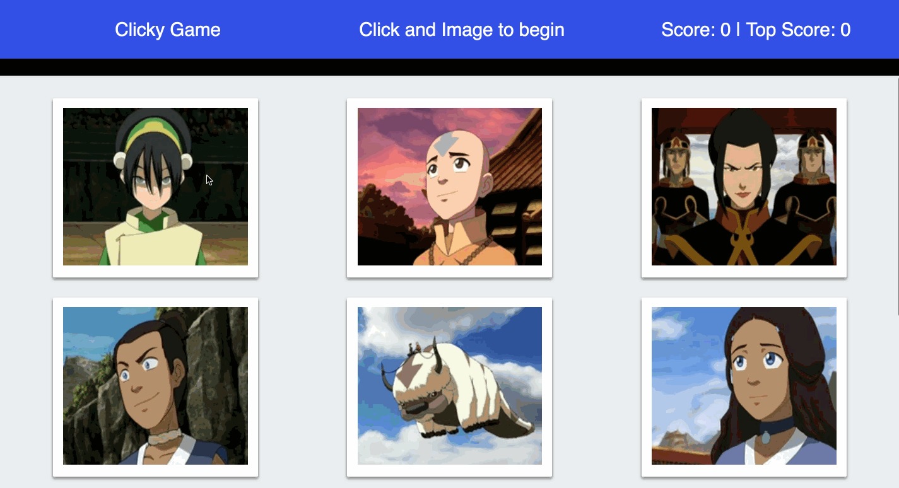

# Clicky_Game

   * Clicky_Game is a memory-like game app created with react.
   * The user will click the images and get a point for each 'correct guess'. The user gets an 'incorrect guess' when he or she clicks the same image twice
   * After an incorrect guess, the game will reset.

    * This app was done with ReactJS, and serves as an introductory assignment to different concepts such as:
        * working in components
        * rendering said components
        * lifecycle methods
        * stateful / stateless components
        * setting the state of different properties after clicking the images.

### Playing the game

    * The user has to click on the different images that are laid out on the screen.
    * For each one the user clicks (without repeating), the user will get 1 point.
    * If the user clicks on any given image twice, the game will end and the score will be reset.

### Showcasing the app

